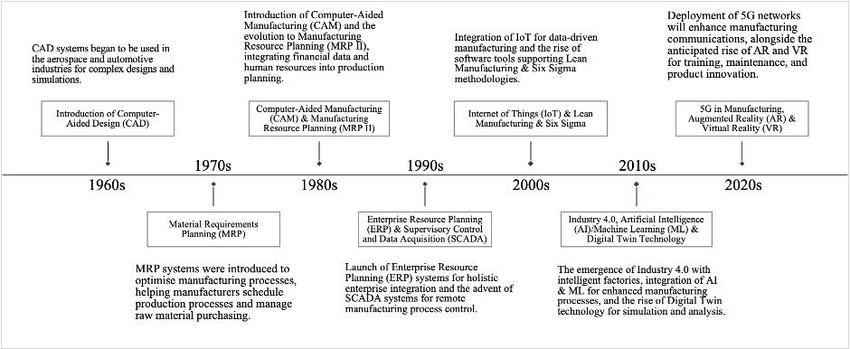

# Digital Transformation in Manufacturing: A Review on Trends, Challenges, and Future Directions

---

## Table of Contents
- [Executive Summary](#executive-summary)
- [Introduction](#introduction)
- [Historic Perspective](#historic-perspective)
- [Current Trends](#current-trends)
- [Impact of Information Systems](#impact-of-information-systems)
- [Information System and Decision-Making](#information-system-and-decision-making)
- [Key Technologies and Trends](#key-technologies-and-trends)
- [Case Studies and Examples](#case-studies-and-examples)
- [Challenges and Limitations](#challenges-and-limitations)
- [Future Directions and Research Gaps](#future-directions-and-research-gaps)
- [Conclusion](#conclusion)
- [References](#references)

---

## Executive Summary

This review examines the digital transformation in manufacturing, highlighting the significant shift from manual processes to sophisticated digital manufacturing, driven by the Fourth Industrial Revolution. Current trends like cloud manufacturing, IoT, and AI play crucial roles in improving efficiency and decision-making, while big data analytics is reshaping supply chain management. Despite the advancements, the challenges of integrating digital technologies into traditional manufacturing processes remain, as seen in case studies like Mercedes-Benz’s Factory 56 and Daimler Truck's collaboration with Siemens Digital Industries Software. 

The future holds promise with Industry 4.0, which emphasizes cyber-physical systems and autonomous production processes. However, more research is required to explore the full potential of Digital Twin technology. Overall, leaders who embrace digital innovation are set to thrive in this evolving sector.

---

## Introduction

The manufacturing industry is undergoing a profound transformation due to the integration of digital technologies and information systems. This shift significantly impacts organizational operations, strategies, and decision-making. This literature review aims to explore the evolution of information technology in manufacturing, the current challenges, and the future trends shaping the industry.

---

## Historic Perspective

Historically, manufacturing has evolved through several technological phases, starting with the automation of structured processes. The introduction of information technology into manufacturing has led to reduced product development times, improved quality, and faster responses to market demands. The Fourth Industrial Revolution has further accelerated this trend, pushing for the digitalization of manufacturing systems.

---

## Current Trends

1. **Cloud Manufacturing (CMfg)**: A service-based approach enabled by IoT, allowing for intelligent access to manufacturing resources.
2. **Artificial Intelligence (AI)**: AI technologies play a key role in optimizing industrial operations and decision-making, particularly in the Industry 4.0 context.
3. **Big Data Analytics**: The integration of big data in manufacturing improves supply chain efficiency and enhances predictive capabilities.

---

## Impact of Information Systems

Information systems have significantly enhanced operational efficiency in manufacturing, especially in material requirements planning (MRP) and inventory control. The initial disruptions caused by these systems eventually lead to significant improvements in organizational performance as businesses adapt.

---

## Information System and Decision-Making

The relationship between information systems and decision-making in manufacturing is complex. With the increasing demands for global competitiveness, manufacturers need to employ multi-objective decision-making (MODM) methods, supported by advanced information systems to handle conflicting criteria in production strategies and technology selection.

---

## Key Technologies and Trends

1. **Digital Factory Concept**: Integrates tools like computer-aided design (CAD) and product data management (PDM) to push manufacturing efficiency to new levels.
2. **Cloud Manufacturing**: Merged with IoT, CMfg allows intelligent resource utilization and optimization.
3. **Artificial Intelligence**: Revolutionizes predictive maintenance, quality assurance, and real-time monitoring, becoming a cornerstone for future manufacturing systems.
4. **Big Data**: Empowers firms with insights to enhance operational and strategic decisions.

---

## Case Studies and Examples

### Mercedes-Benz: Factory 56
Mercedes-Benz's Factory 56 in Sindelfingen epitomizes the future of automotive production, blending flexibility, digitalization, efficiency, and sustainability. With an investment of around 730 million Euros, this facility aims to enhance efficiency by a quarter compared to its predecessor. Remarkably, it can adapt its production lines to market demands in mere days. Sustainability is at the heart of Factory 56, which operates as a zero-carbon entity. It harnesses innovative energy solutions, including a photovoltaic system and a DC power grid, and even repurposes vehicle batteries for energy storage. Beyond technology, the well-being of its workforce is paramount. Ergonomic designs, modern amenities, and a focus on work-life balance ensure a conducive environment for employees. Interestingly, the steel used in its construction equals the weight of Paris's Eiffel Tower. As a testament to its success, the Factory 56 model is poised to be replicated across Mercedes-Benz's global facilities.

### Daimler Truck: Siemens Digital Industries Software
On the other hand, Daimler Truck, a global leader in truck and bus manufacturing, embarked on a digital transformation journey to foster vehicle development innovation. Collaborating with Siemens Digital Industries Software, Daimler Truck aims to establish a cutting-edge digital engineering platform using the Siemens Xcelerator portfolio. This global platform will streamline truck and bus product development and lifecycle management processes. By integrating workflows, systems, and design data, the platform will offer a cohesive IT landscape for Daimler Truck. Their decision to adopt Teamcenter as the core of their integrated engineering platform underscores Daimler Truck's dedication to digitalization and the importance of a unified IT framework.

---

## Challenges and Limitations

Despite the progress, several challenges remain:
- **Organizational Ambidexterity**: Balancing traditional manufacturing processes with digital innovation is a significant challenge.
- **Resistance to Change**: Companies often face internal resistance when implementing digital technologies due to the lack of immediate economic benefits.
- **Integration Issues**: Operationalizing a transformative digital strategy requires more than just technology; it needs a systematic approach.

---

## Future Directions and Research Gaps

Industry 4.0 envisions a future where cyber-physical systems dominate manufacturing. Products will control their own production processes, allowing for mass customization. However, challenges such as understanding the full potential of Digital Twin (DT) technology and addressing gaps in holistic technology adoption need further exploration.

---

## Conclusion

The journey towards digital transformation in manufacturing is complex but promising. The integration of technologies like AI, IoT, and big data is revolutionizing the sector, making operations more efficient and responsive to market demands. Leaders in the manufacturing industry who embrace these innovations are poised to thrive in the future of digital manufacturing.

---

## References

- Caldeira, M.M. and Ward, J.M. (2003). Using resource-based theory to interpret the successful adoption of IS in manufacturing SMEs.
- Chakraborty, S. (2011). Applications of the MOORA method for decision-making in manufacturing environments.
- Chryssolouris, G. et al. (2009). Digital manufacturing: History, perspectives, and outlook.
- Mercedes-Benz. (2023). Factory 56 overview. [Link](https://group.mercedes-benz.com/innovation/digitalisation/industry-4-0/opening-factory-56.html).
- Siemens. (2023). Daimler Truck digitalization journey. [Link](https://blogs.sw.siemens.com/teamcenter/daimler-truck-digitalization/).
- And others...
