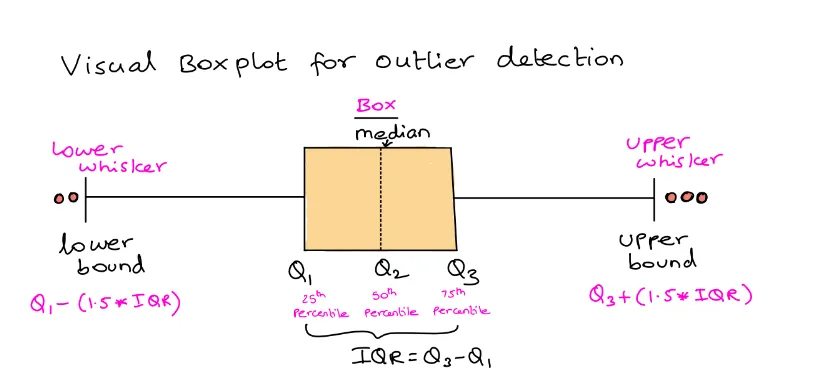

# Mastering Data Cleaning: 5 Simple Steps to Automate with Python

In our world that relies on data, it's really important to have clean data to get the right answers and make good choices. Manually cleaning data can take a lot of time and can have mistakes. Python has strong tools to clean data automatically, making it faster and more accurate. 

In this article, I'll show you 5 easy steps to clean data automatically with Python.

## Step 1: Setting Up Your Environment

Before we start cleaning up our data, let's get Python ready. First, make sure you have Python installed on your computer. Then, let's get the tools we need by installing these libraries:

```python
pip install pandas numpy
```

These libraries are our main tools for working with and understanding data. Pandas give us DataFrames, which are perfect for cleaning up messy data, while NumPy helps us work with large amounts of data organized in rows and columns.

## Step 2: Handling Data Formats

Data can come in many forms, like CSV files, JSON files, or even Excel spreadsheets. Each type needs a different way to open and work with it. Pandas has tools to help with this, making it simple to bring your data into a DataFrame like a table with rows and columns. Let me explain how and show you the Python code for different data types:

#### Code Explained:

The read_data(file_path) function takes the location of your file and figures out what type of file it is (CSV, JSON, etc.). Then, it uses the right Pandas tool to open the file and put the data into a DataFrame so you can start working with it.

```python
import os
import pandas as pd

def read_data(file_path):
    # Extract the file extension
    _, file_ext = os.path.splitext(file_path)
    
    # Read data based on file extension
    if file_ext == '.csv':
        return pd.read_csv(file_path)
    elif file_ext == '.json':
        return pd.read_json(file_path)
    elif file_ext in ['.xls', '.xlsx']:
        return pd.read_excel(file_path)
    else:
        raise ValueError("Unsupported file format")

# Load your dataset
df = read_data('your_dataset.csv')

```

#### Detailed Steps:
##### 1. Extract the File Extension:
- The function uses `os.path.splitext(file_path)` to split the file path into two parts: the root and the extension. The extension is stored in `file_ext`.

##### 2. Conditional Reading Based on Extension:

- If the file extension is `.csv`, it uses `pd.read_csv(file_path)` to read the data into a DataFrame.
- If the file extension is `.json`, it uses `pd.read_json(file_path)`.
- If the file extension is `.xls` or `.xlsx`, it uses `pd.read_excel(file_path)`.
- If the file format is unsupported, it raises a ValueError with an appropriate message.

This function ensures you can handle multiple data formats with a single function call, making your data import process more flexible and efficient. Let’s break down the supported formats:

- CSV (Comma-Separated Values): It is commonly used for data exchange because it’s simple and supported by many applications.
- JSON (JavaScript Object Notation): Used for transmitting data in web applications. 
- Excel Files: Widely used for data storage and analysis in business contexts.

## Step 3: Dealing with Duplicates

Duplicate data can skew your analysis and lead to incorrect conclusions. Eliminating duplicates ensures that each piece of information in your dataset is unique, giving you a clearer picture of the data. Let's delve deeper into how to tackle duplicates and break down the Python code that makes it happen.

### Code Explanation
The `drop_duplicates(df, columns=None)` function acts as a data detective, meticulously identifying and removing duplicate rows lurking within your DataFrame.

```python
def drop_duplicates(df, columns=None):
    if columns is None:
        df.drop_duplicates(inplace=True)
    else:
        df.drop_duplicates(subset=columns, inplace=True)
    return df

# Apply the function to your dataset
df = drop_duplicates(df)
```

### Detailed Steps:

#### 1. Check for Duplicates:

- The function `drop_duplicates` takes a DataFrame `df` and an optional parameter columns.
- If columns are not provided, the function checks for duplicates across all columns.
- If columns are specified, it checks for duplicates only within the specified subset of columns.

#### 2. Remove Duplicates:

- `df.drop_duplicates(inplace=True)` removes duplicate rows directly in the original DataFrame if no columns are specified.
- `df.drop_duplicates(subset=columns, inplace=True)` removes duplicate rows based on the subset of columns specified.

#### 3. Return the Cleaned DataFrame:

- The function returns the cleaned DataFrame with duplicates removed.

#### Example:
Assume you have a DataFrame with the following data:

| Name | Age | Gender | Country |
|------|-----|--------|---------|
| John | 28  | Male   | USA     |
| Anna | 22  | Female | UK      |
| John | 28  | Male   | USA     |
| Mike | 32  | Male   | Canada  |


To remove duplicate rows based on all columns:

```python
df = drop_duplicates(df)
```

This will result in:

| Name | Age | Gender | Country |
|------|-----|--------|---------|
| John | 28  | Male   | USA     |
| Anna | 22  | Female | UK      |
| Mike | 32  | Male   | Canada  |


To remove duplicate rows based on specific columns, say `['Name', 'Age']`:

```python
df = drop_duplicates(df, columns=['Name', 'Age'])
```

This will result in the same DataFrame as above since the duplicate row was identified by matching the Name and Age columns. Removing duplicates helps ensure that your dataset contains unique observations, which is crucial for accurate analysis and results.


## Step 4: Handling Missing Values

Missing values are a frequent hurdle in data analysis. However, Python equips us with the tools to address them effectively.  Whether your strategy involves eliminating rows with missing data or employing imputation techniques, understanding the available methods and their corresponding code is key. Let's delve into the details and empower ourselves to make informed decisions about our data.

### Code Explanation

The process involves two main functions: check_missing_data(df) and dealing_missing_data(df). The check_missing_data(df) function assesses the proportion of missing values in the DataFrame and decides whether to drop rows with missing values or handle them column by column. The dealing_missing_data(df) function then addresses missing values by either imputing them or flagging them for further inspection.

Two primary functions drive this process: `check_missing_data(df)` evaluates the extent of missing values and determines the handling strategy (row deletion or column-wise imputation). Subsequently, `dealing_missing_data(df)` executes the chosen approach, either filling in missing values or marking them for review.

```python
def check_missing_data(df):
    # Calculate the proportion of rows with any missing values
    proportion_null_rows = 100 * (df.isnull().any(axis=1).sum() / df.shape[0])
    
    if proportion_null_rows <= 5:
        print(f"There are {df.isnull().any(axis=1).sum()} rows with null values. All of them are erased!")
        df.dropna(inplace=True)
    else:
        print("Too many null values, we need to check columns by columns further.")
        if df.isnull().sum().sum() > 0:
            print("\nProportion of missing values by column")
            values = 100 * (df.isnull().sum() / df.shape[0])
            print(values)
            dealing_missing_data(df)
        else:
            print("No missing values detected!")

def dealing_missing_data(df):
    # Handle the missing values
    values = 100 * (df.isnull().sum() / df.shape[0])
    to_impute = []
    to_check = []
    
    for name, proportion in values.items():
        if int(proportion) == 0:
            continue
        elif int(proportion) <= 10:
            to_impute.append(name)
            df[name].fillna(df[name].median(), inplace=True)
        else:
            to_check.append(name)
    
    print(f"\nThe missing values in {to_impute} have been replaced by the median.")
    print(f"The columns {to_check} should be further investigated.")

# Apply the function to your dataset
check_missing_data(df)
```

### Detailed Steps:

#### 1. Calculate the Proportion of Rows with Missing Values:

- The function calculates the proportion of rows containing any missing values using `df.isnull().any(axis=1).sum()` divided by the total number of rows `df.shape[0]`.

#### 2. Decide on Dropping or Imputing Missing Values:

- If the proportion of rows with missing values is less than or equal to **5%**, it drops those rows using `df.dropna(inplace=True)`.
- If more than **5%** of the rows contain missing values, it prints the proportion of missing values for each column and calls the `dealing_missing_data(df)` function to handle the missing values.

#### 3. Handle Missing Values Column by Column:

- The `dealing_missing_data(df)` function iterates over each column and its proportion of missing values.
- If the proportion of missing values in a column is less than or equal to **10%**, it fills the missing values with the median of that column using `df[name].fillna(df[name].median(), inplace=True)`.
- If the proportion of missing values in a column is greater than **10%**, it flags that column for further investigation.

#### 4. Return the Cleaned DataFrame:

- The function prints which columns had their missing values imputed and which columns require further investigation.


## Step 5: Dealing with Outliers

Outliers, those exceptional data points that deviate significantly from the norm, wield the power to distort the very fabric of your analysis. Taming these unruly values requires a strategic approach, often involving the establishment of thresholds, the capping of extreme values, or the utilization of sophisticated statistical techniques like the Z-score. Among these methods, the **Interquartile Range (IQR)** emerges as a popular and effective tool for outlier detection. Let's delve deeper into this insightful technique and uncover the Python code that will equip you to identify and manage outliers with precision.



*Image from [Unraveling Outliers: Detecting, Taming, and Analyzing Data Mavericks — Exploring Effective Methods and Strategies for Handling Outliers](https://medium.com/@shubavarma/unraveling-outliers-detecting-taming-and-analyzing-data-mavericks-exploring-effective-methods-498f3f0928ab)*

### Code Explanation

The function `find_outliers_IQR(df)` identifies outliers in a DataFrame using the IQR method. It calculates the first (Q1) and third (Q3) quartiles, computes the IQR, and then determines the lower and upper bounds to identify outliers.

```python
def find_outliers_IQR(df):
    outlier_indices = []
    df = df.select_dtypes(include=['number'])
    for column in df.columns:
        Q1 = df[column].quantile(0.25)
        Q3 = df[column].quantile(0.75)
        IQR = Q3 - Q1
        lower_bound = Q1 - 1.5 * IQR
        upper_bound = Q3 + 1.5 * IQR

        # Get the indices of outliers for each column
        outlier_list_col = df[(df[column] < lower_bound) | (df[column] > upper_bound)].index
        outlier_indices.extend(outlier_list_col)

    outlier_indices = list(set(outlier_indices))  # Get unique indices
    return df.iloc[outlier_indices]

# Find outliers in your dataset
outliers_df = find_outliers_IQR(df)
print(outliers_df)
```

### Detailed Steps:

#### 1. Select Numeric Columns:

- The function first filters the DataFrame to include only numeric columns using `df.select_dtypes(include=['number'])`.

#### 2. Calculate Quartiles and IQR:

- For each numeric column, the function calculates the first quartile (Q1) using df[column].quantile(0.25) and the third quartile (Q3) using `df[column].quantile(0.75)`.
- It computes the IQR by subtracting Q1 from Q3: **IQR = Q3 - Q1**.

#### 3. Determine Lower and Upper Bounds:

- The function calculates the lower bound as **Q1 - 1.5 * IQR** and the upper bound as **Q3 + 1.5 * IQR**.

#### 4. Identify Outliers:

- It identifies outliers by finding rows where the column value is less than the lower bound or greater than the upper bound: `df[(df[column] < lower_bound) | (df[column] > upper_bound)]`.
- The indices of these outliers are collected in the outlier_indices list.

#### 5. Return DataFrame with Outliers:

- The function returns a DataFrame containing only the rows identified as outliers using `df.iloc[outlier_indices]`.

### Example:

Assume you have a DataFrame with numeric data:

| Age | Salary  |
|-----|---------|
| 25  | 50000   |
| 30  | 60000   |
| 22  | 55000   |
| 35  | 70000   |
| 28  | 65000   |
| 40  | 90000   |
| 18  | 40000   |
| 50  | 100000  |

Using the `find_outliers_IQR(df)` function, the outliers would be identified based on the calculated IQR for each column, and you can then decide how to handle these outliers, such as removing them or capping their values.

## Automating the Process

Automating the data cleaning process can significantly save time and ensure consistency in handling various datasets. By combining all the steps into a single Python script, you can streamline the entire data cleaning workflow. Here's a detailed explanation and the corresponding Python code to automate the data-cleaning process:

### Code Explanation

The `clean_data(file_path)` function integrates all the previous steps into a cohesive data-cleaning pipeline. It reads the data, handles missing values, removes duplicates, and identifies outliers.

```python
import pandas as pd
import os

def clean_data(file_path):
    # Read the data based on its format
    df = read_data(file_path)
    
    # Handle missing values
    check_missing_data(df)
    
    # Remove duplicates
    df = drop_duplicates(df)
    
    # Find and handle outliers
    outliers_df = find_outliers_IQR(df)
    
    return df

# Apply the function to your dataset
cleaned_df = clean_data('your_dataset.csv')
```

### Detailed Steps:

#### 1. Read the Data:

- The function calls read_data(file_path) to read the data into a DataFrame based on its file format (CSV, JSON, or Excel).

#### 2. Handle Missing Values:

- The function calls check_missing_data(df) to assess and handle missing values. Depending on the proportion of missing data, it either drops rows with missing values or imputes them with the median of the column.

#### 3. Remove Duplicates:

- The function calls drop_duplicates(df) to remove duplicate rows from the DataFrame, ensuring each observation is unique.

#### 4. Identify and Handle Outliers:

- The function calls find_outliers_IQR(df) to identify outliers in the numeric columns using the IQR method. You can decide whether to remove or handle these outliers further.

#### 5. Return the Cleaned DataFrame:

- The function returns the cleaned DataFrame, ready for analysis.

## Wrapping Up

Data cleaning is essential, but it doesn't have to be a bottleneck. Python automation offers a solution. By following these 5 straightforward steps, you can streamline your preprocessing, mitigate errors, and shift your focus to uncovering valuable patterns and trends within your data.


